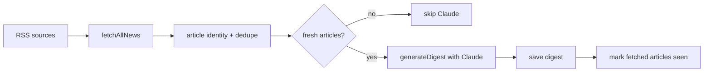

# Everyday News

Everyday News 是一个部署在 Vercel 的每日 AI 新闻摘要应用。应用抓取配置中的 RSS 订阅，先用稳定 article id 做去重和新鲜度过滤，再把新文章交给 Claude 生成中文新闻摘要，最后把报告保存到 Upstash Redis 并展示在报告页。

线上地址：https://everyday-news-xi.vercel.app

## 核心流程



## 运行与验证

```bash
npm run dev
npm run build
npm run lint
./node_modules/.bin/tsc --noEmit
./node_modules/.bin/tsc -p temp/test_article_freshness/tsconfig.json && node temp/test_article_freshness/dist/temp/test_article_freshness/article_identity.test.js
```

## 关键环境变量

| 变量 | 用途 |
| --- | --- |
| `ANTHROPIC_API_KEY` | Claude API key |
| `CRON_SECRET` | 保护 cron/generate API，并用于 session cookie 签名 |
| `UPSTASH_REDIS_REST_URL` | Upstash Redis URL |
| `UPSTASH_REDIS_REST_TOKEN` | Upstash Redis token |
| `APP_PASSWORD` | 可选登录口令，默认 `TRUSO` |

## 关键模块

| 路径 | 职责 |
| --- | --- |
| `lib/fetcher.ts` | 抓取 RSS，裁剪摘要，生成 article id，做单轮去重 |
| `lib/articleIdentity.ts` | 规范化 URL、生成稳定 article id、过滤新文章 |
| `lib/summarizer.ts` | 调用 Claude stream + tool schema 生成结构化摘要 |
| `lib/storage.ts` | 读写配置、报告、历史日期和已见文章集合 |
| `app/api/generate/route.ts` | 手动 SSE 生成流程 |
| `app/api/cron/route.ts` | Vercel Cron 生成流程 |

## 去重策略

文章身份优先级是 `id`、`guid`、规范化后的 `link`、最后退回到 `source/title/pubDate` 哈希。URL 规范化会移除 `utm_*`、`fbclid`、`gclid` 等 tracking 参数。生成前会查询 Redis 的 `articles:seen` 集合和最近报告中的链接；没有新文章时跳过 Claude 调用，避免重复消耗 API 余额。
